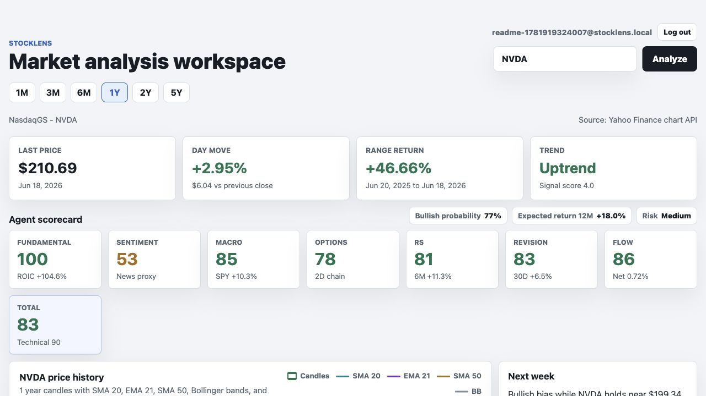
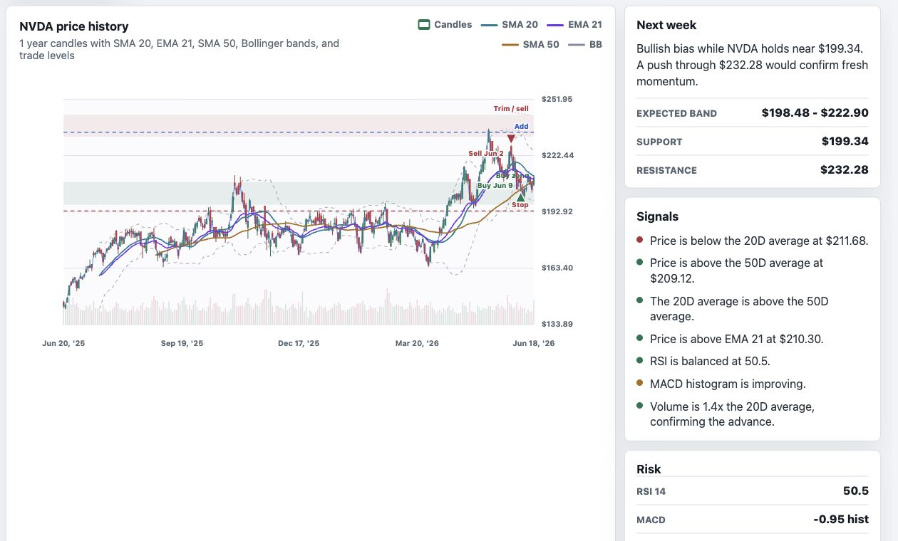
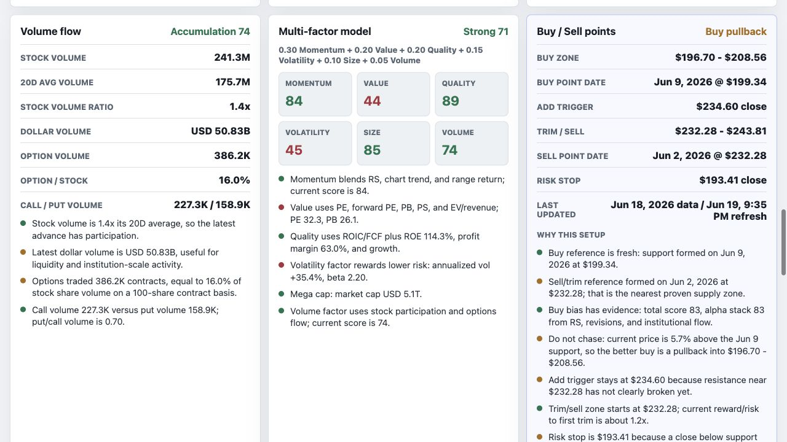
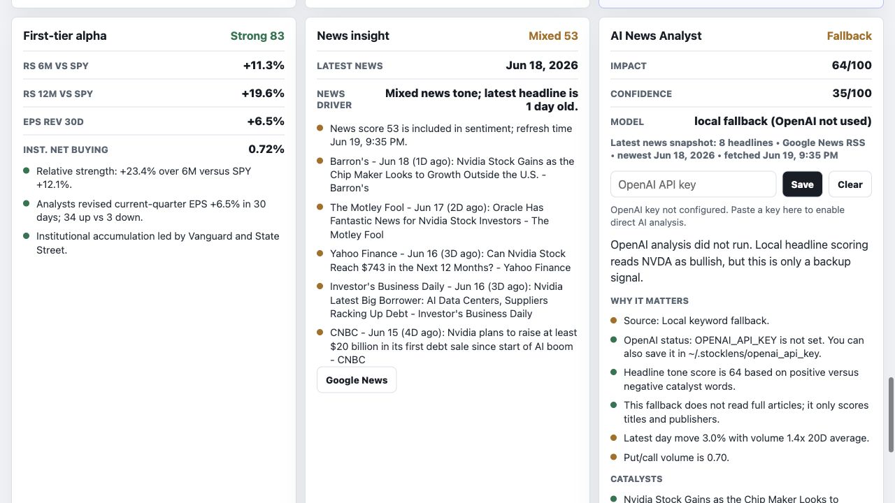

# StockLens

StockLens is an AI-assisted full-stack equity research platform. It combines market-data ingestion, technical analysis, options-flow metrics, multi-factor scoring, account-based personalization, and OpenAI-powered news impact analysis.

> Scenario analysis only. This project is not financial advice.

## Features

- User registration, login, logout, and HttpOnly session cookies
- SQLite-backed user accounts, settings, transcript notes, search history, and optional OpenAI API key storage
- Stock search for tickers such as `NVDA`, `AAPL`, `MSFT`, `TSLA`, and `SPY`
- Candlestick chart with SMA 20, EMA 21, SMA 50, Bollinger Bands, and volume bars
- Technical indicators: RSI, MACD, ATR, volatility, max drawdown, support/resistance
- Buy/add/trim/sell/stop levels marked directly on the chart
- Options-market analytics: put/call ratio, implied volatility, expected move, gamma proxy, and option volume
- Fundamental quality signals: ROIC and free-cash-flow growth
- Relative strength versus SPY
- Earnings revision and institutional-flow proxy signals
- Multi-factor stock score using momentum, value, quality, volatility, size, and volume
- Latest-news ingestion and OpenAI-based impact analysis with fallback scoring

## Screenshots

### Dashboard main page



### Stock search and candlestick chart



### Multi-factor scorecard and buy/sell levels



### AI news impact analysis



## Sample Output

Example values from an `NVDA` run. Results change as market data, options chains, and news update.

```text
Ticker: NVDA
Technical trend: Uptrend
Bullish probability: 77%
Expected return 12M: +18.0%
Volatility: 35.4% annualized
Max drawdown: -20.2%
Relative strength vs SPY: +11.3% over 6M, +19.6% over 12M
Options put/call volume: 0.70
Stock volume: 1.4x 20D average
Multi-factor score: Strong 71/100
News impact: Mixed, confidence 35/100
Buy zone: $196.70 - $208.56
Trim / sell zone: $232.28 - $243.81
Risk stop: $193.41 close
```

## Tech Stack

- Backend: Python standard library HTTP server
- Frontend: HTML, CSS, JavaScript
- Database: SQLite
- Market data: Yahoo Finance public endpoints
- News data: Google News RSS
- AI analysis: OpenAI Responses API

## Architecture

```text
Frontend: static/index.html, static/app.js, static/styles.css
Backend: main.py HTTP API using Python ThreadingHTTPServer
Database: SQLite tables for users, sessions, user_settings, and transcripts
Data: Yahoo Finance chart/options/fundamentals endpoints and Google News RSS
AI: OpenAI Responses API for structured news impact analysis, with local fallback scoring
```

## Project Structure

```text
stocklens/
├── docs/
│   └── screenshots/
│       ├── dashboard-main.png
│       ├── candlestick-chart.png
│       ├── multi-factor-scorecard.png
│       └── ai-news-impact.png
├── main.py
├── static/
│   ├── index.html
│   ├── app.js
│   └── styles.css
├── requirements.txt
├── .env.example
├── .gitignore
├── .dockerignore
├── Dockerfile
└── README.md
```

## Local Setup

Requires Python 3.10+.

```sh
python3 -m venv .venv
source .venv/bin/activate
pip install -r requirements.txt
python main.py
```

Open:

```text
http://127.0.0.1:8000
```

If port `8000` is busy, StockLens automatically tries the next available port.

## Environment Variables

```text
OPENAI_API_KEY=your_openai_api_key
STOCKLENS_DB_PATH=./data/stocklens.sqlite3
HOST=127.0.0.1
PORT=8000
STOCKLENS_COOKIE_SECURE=0
```

For public deployment behind HTTPS:

```text
HOST=0.0.0.0
PORT=8000
STOCKLENS_COOKIE_SECURE=1
```

## Docker

```sh
docker build -t stocklens .
docker run -p 8000:8000 \
  -e HOST=0.0.0.0 \
  -e PORT=8000 \
  -e STOCKLENS_DB_PATH=/data/stocklens.sqlite3 \
  -e OPENAI_API_KEY=your_openai_api_key \
  -v stocklens-data:/data \
  stocklens
```

## Security Notes

- Do not commit `.env`, SQLite databases, API keys, or local `.stocklens` folders.
- Passwords are stored with PBKDF2 hashes.
- Session cookies are HttpOnly and SameSite=Lax.
- For production, prefer a server-side `OPENAI_API_KEY` environment variable instead of user-entered API keys.
- Use HTTPS before setting `STOCKLENS_COOKIE_SECURE=1`.

## Limitations

- StockLens is a research prototype and is not financial advice.
- Public market-data endpoints may be delayed, incomplete, rate-limited, or unavailable.
- OpenAI output is scenario analysis, not a trading instruction or guaranteed forecast.
- Scores are heuristic signals and should be validated with independent research before use.
- The local server is not a production-grade trading platform or brokerage execution system.
- Public-news and headline analysis can miss full article context, valuation impact, and whether a catalyst is already priced in.
